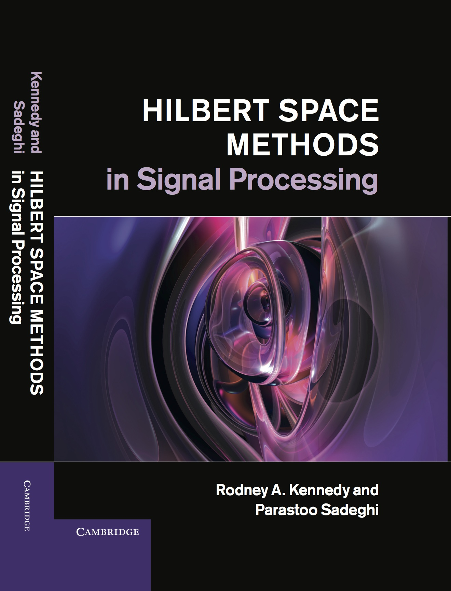



## Citing the Book


---

## Dust Jacket Description

*This lively and accessible book describes the theory and applications of Hilbert spaces and also presents the history of the subject to reveal the ideas behind theorems and the human struggle that led to them. The authors begin by establishing the concept of 'countably infinite', which is central to the proper understanding of separable Hilbert spaces. Fundamental ideas such as convergence, completeness and dense sets are first demonstrated through simple familiar examples and then formalised. Having addressed fundamental topics in Hilbert spaces, the authors then go on to cover the theory of bounded, compact and integral operators at an advanced but accessible level. Finally, the theory is put into action, considering signal processing on the unit sphere, as well as reproducing kernel Hilbert spaces. The text is interspersed with historical comments about central figures in the development of the theory, which helps bring the subject to life.*

---

## Table of Contents

<pre>
<b>I Hilbert Spaces</b>
1 Introduction
   1.1 Introduction to Hilbert spaces
      1.1.1 The basic idea
      1.1.2 Application domains
      1.1.3 Broadbrush structure
      1.1.4 Historical comments
   1.2 Infinite dimensions
      1.2.1 Why understand and study infinity?
      1.2.2 Primer in transfinite cardinals
      1.2.3 Uncountably infinite sets
      1.2.4 Continuum as a power set
      1.2.5 Countable sets and integration

2 Hilbert Spaces
   2.1 Space hierarchy: algebraic, metric, geometric
   2.2 Complex vector space</pre>
{:. style="color: rgba(32,32,32,1); font-size: 1rem; font-family: "PT Sans", Helvetica, Arial, sans-serif; background-color: #ffffff;"}

---

## Links Relevant to the Book

- [Cambridge Site](http://www.cambridge.org/aus/catalogue/catalogue.asp?isbn=9781107010031)
- [Amazon Site](http://www.amazon.com/Hilbert-Space-Methods-Signal-Processing/dp/1107010039)
- [Google Books](http://books.google.com.au/books?isbn=1107328357)

---

## Errata

- page 26, missing norm in triangle inequality

$$
	\color{#6A9FB5}\|f+g\| \le \|f\|+\|g\|,\quad \forall f,g\in\mathcal{H}.\hspace{20mm}(2.4)
$$

- page 337, two corrections in Remark 10.6: "$$\color{#6A9FB5}\text{as }n \rightarrow \infty$$" and "$$\color{#6A9FB5}\text{convergence}$$"

- page 350, typo, this should read "$$\color{#6A9FB5}\text{associate}$$"

- page 332 Definition 10.2 and 10.3; Is there an misprint at this location "...for all f in " - H or L2(omega)?

