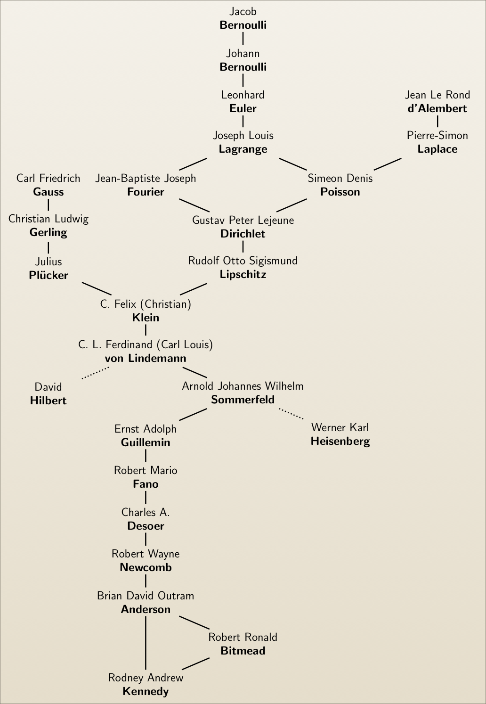

### *Contents*{: style="color: gray"}
{:.no_toc}

* TOC
{:toc}

---  

## Academic Genealogy

This figure I derived from the data available at the [Mathematics Genealogy Project][mathgp]

---

## Windsurfing

Windsurfing video captured from a helmet mounted GoPro Hero HD camera.[^1] The final gust lifts the front of the board causing the bailout. The GPS hit 54 kph at the time of the bailout. Formula board with a 8.4 m2 sail.

<iframe width="720" height="405"
	src="https://www.youtube.com/embed/Zz5dUB4Ahbo?vq=hd720"
	frameborder="0" allowfullscreen>
</iframe>

---

## Astronomy

A bit of signal processing on my backyard astro captures (sorry about the music).

<iframe width="420" height="315"
	src="https://www.youtube.com/embed/oJhM9Wg8y-k"
	frameborder="0" allowfullscreen>
</iframe>

---

[^1]: This is dedicated to [Bobby][bobby], who is seen briefly in background at around time 0:20.
[bobby]: http://www.canberratimes.com.au/act-news/missing-windsurfers-body-found-in-lake-tuggeranong-20131224-2zvxk.html
[mathgp]: http://genealogy.math.ndsu.nodak.edu
