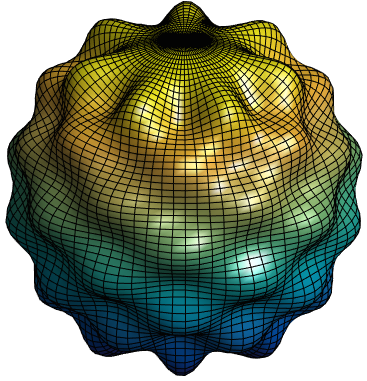



{: height="250px"}

matlab/sh_plot.m
matlab/sh_plot_animate.m

### MATLAB&reg; code &mdash; [<code>{{ shplot | split: "/" | last }}</code>]({{ shplot }})

This is adapted from the [Matlab Website](http://www.mathworks.com/examples/matlab/1226-animating-a-surface)





### MATLAB&reg; code &mdash; [<code>{{ animate | split: "/" | last }}</code>]({{ animate }})




