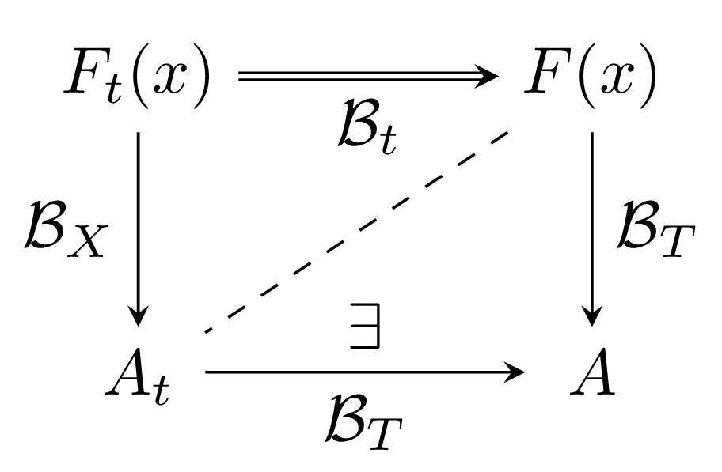



latex/tikz-ext-png.tex

### Latex code &mdash; <a href="{{ filePath }}"><code>tikz-ext-png.tex</code></a>





### Output png figure &mdash; [<code>myfigure.png</code>](latex/figures/myfigure.png) (150dpi)

{: class="matlab"}

### Output png figure &mdash; [<code>myfigure-600.png</code>](latex/figures/myfigure-600.png) (600dpi)

{: class="matlab"}

### Exporting to png Notes

- this is always done by first generating the vector graphic pdf and then rasterizing to png
- png is web friendly and defaults with a transparent background
- <code>\usepgfplotslibrary{external}</code> needs your latex system to be configured to run shell commands
	- for example in TeXShop, adding <code>--shell-escape</code> such as  <code>pdflatex --file-line-error --shell-escape --synctex=1</code>
	- enabling this can make your system vulnerable to malicious latex documents
- make sure you have an existing <code>figures</code> subdirectory if you use the <code>\tikzsetexternalprefix</code> line (as above)
	- this will create files <code>figures/myfigure.pdf</code> and <code>figures/myfigure.png</code>
	- otherwise just comment out this line to have the files <code>myfigure.pdf</code> and <code>myfigure.png</code> (in the same directory)
- png generation uses the <code>convert</code> command from [Imagemagick&reg;](http://www.imagemagick.org/script/index.php)
	- Imagemagick&reg; needs to be installed and can be a bit horendous to set up
	- Imagemagick&reg; is usually, but not always, installed at <code>/opt/local/bin</code>
- alternative png generation using:
 [sips](https://developer.apple.com/library/mac/documentation/Darwin/Reference/ManPages/man1/sips.1.html) &mdash; scriptable image processing system
	- use: <code>sips -s format png --out "\image.png" "\image.pdf";</code>
	- good: <code>sips</code> is pre-installed on OSX
	- bad: it won't let you rasterize the pdf at other than a fixed dpi (150)

### Debugging Latex code &mdash; [<code>tikz-ext-png-debug.tex</code>](latex/tikz-ext-png-debug.tex)

Use the modified latex:





If <code>convert</code> is succesfully found should induce this portion of the console message:

~~~

~~~

If <code>convert</code> cannot be found or your <code>PATH</code> can't point to it then hardwire the path such as follows: 
<code>/opt/local/bin/convert -units pixelsperinch -density 150 "\image.pdf" "\image.png";</code>

If silent weird things are happening then comment out the externalization like this <code>%\tikzexternalize</code>.  This will let latex stop and display errors.

### Downloads

- [<code>tikz-ext-png.tex</code>](latex/tikz-ext-png.tex)
- [<code>tikz-ext-png-debug.tex</code>](latex/tikz-ext-png-debug.tex)
- [<code>tikz-ext-png.pdf</code>](latex/tikz-ext-png.pdf)

- [<code>myfigure.png</code>](latex/figures/myfigure.png)
- [<code>myfigure-600.png</code>](latex/figures/myfigure-600.png)
