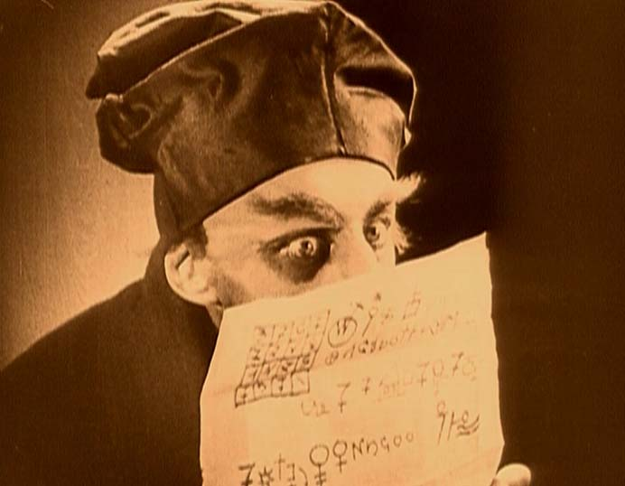



## Current PhD Students

PhD&nbsp;Student | Topic| Start&nbsp;Date
:-: | :-: | :-:
[Usama Elahi](http://www.uet.edu.pk/faculties/facultiesinfo/facultyinfo?fac_id=841) | Harnessing Spherical Geometry in Data Processing | Aug 2015
[Alice Bates](http://people.cecs.anu.edu.au/user/5215) | Spherical Biological Signals Processing | Feb 2014
[Yirui Cong](http://people.cecs.anu.edu.au/user/5178) | Mobility Models and Analysis in Ad Hoc Networks | Dec 2013
[Ni Ding](http://people.cecs.anu.edu.au/user/4928) | Cross-layer Transmission Control in Wireless | Jul 2013



## Recent Past PhD Students

### PhD Students With Thesis Under Examination

- [Yibeltal Alem](http://people.cecs.anu.edu.au/user/4441) --- sparse spherical processing
- [Shahriar Etemadi Tajbakhsh](http://people.cecs.anu.edu.au/user/4108) --- cooperative network coding

### Recently Graduated PhD Students

- [Dr Prasad Samarasinghe 2014](http://www.lankabell.com/lanka_bell_corporate_profile.htm) --- Managing Director Lanka Bell
- Dr Daniel Chae 2014 --- SK telecom -- South Korea Telecom
- [Dr Nicolo Malagutti 2014](http://people.cecs.anu.edu.au/user/4029) --- ANU Casual Lecturer
- [Dr Zubair Khalid 2013](http://www.zubairkhalid.org/home.html) --- ARC funded postdoc at ANU
- [Dr Ali Nasir 2013](http://people.cecs.anu.edu.au/user/3835) --- ARC funded postdoc at ANU
- [Dr Karan Zhang 2012](http://www.lms.lnt.de/en/people/staff/mengqiu-zhang.php)  --- University of Erlangen-Nuremberg
- [Dr Pradeepa Samarasinghe 2011](http://computing.sliit.lk/researcher/dr-pradeepa-samarasinghe/) --- Senior Lecturer SIIT



## Future Students

### How to Apply to the ANU Doctor of Philosophy (PhD) Program

Follow the application process described in [Graduate Research][gredres]

- Perform the [Self Assessment][selfass]
- If you pass the first step then read [Pre-application process][preap]
- Send an email to me that:
	1. is clear and coherent
	2. indicates where you were ranked in your year, and prizes you have received
	3. lists or includes papers you have written (theses)
	4. uses only PDF attachments (not Word docx)
	5. contains only academically pertinent information

[gredres]: http://cecs.anu.edu.au/future_students/graduate/research
[selfass]: http://cecs.anu.edu.au/future_students/graduate/research/selfassessment
[preap]: http://cecs.anu.edu.au/future_students/graduate/research/preapplication


